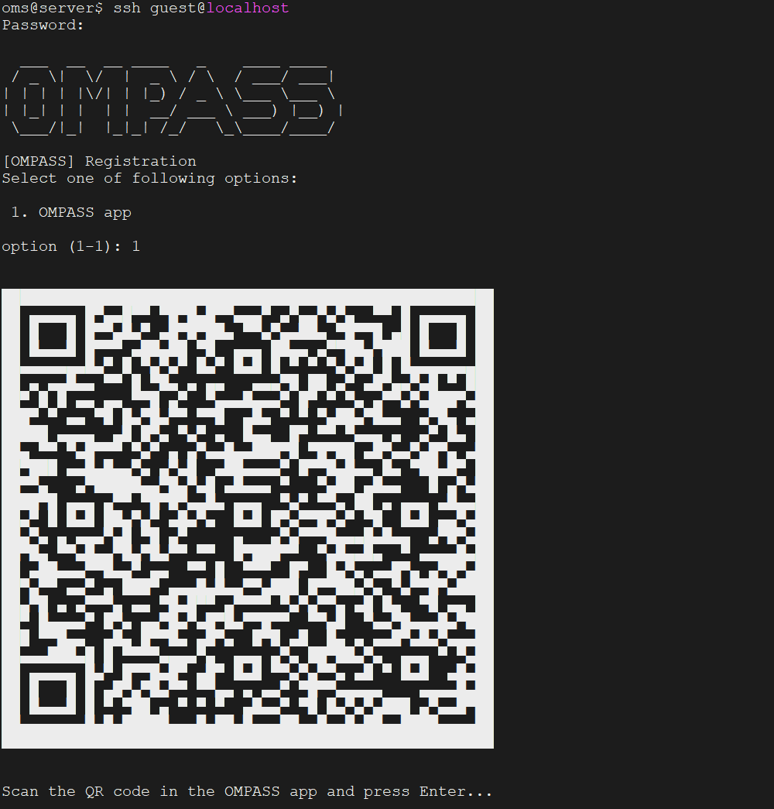
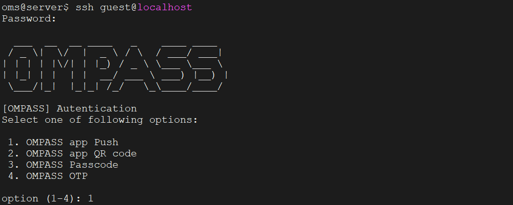

# OMPASS PAM (SSH)
## 개요
OMPASS PAM(Pluggable Authentication Modules)을 설치하여 Linux 시스템의 원격(SSH) 또는 로컬 로그인을 보호합니다.
## 사전 작업
1. **OMPASS Portal** 에 관리자 계정으로 로그인하세요.

2. **어플리케이션** → **추가**로 이동합니다.

3. **유형**을 **Linux SSH** 로 선택하고 이름, 정책 설정 등을 추가한 후 **저장**을 클릭합니다.

4. 어플리케이션 목록 중 생성한 Linux SSH 어플리케이션을 클릭합니다. **API 서버 주소**, **클라이언트 아이디**, **시크릿 키**를 가져옵니다.
## OMPASS 설치
1. Ubuntu 기준
```
wget [download link]
dpkg -i ompass-pam_2.X.X-X.deb
```

## OMPASS 설정
`ompass-pam` 패키지 설치가 완료되면,  `/opt/oms/ompass2/pam/conf.d/`에 위치한 `pam_oms.conf` 설정 파일을 찾을 수 있습니다. 

설정 파일은 <u>[INI 형식](https://en.wikipedia.org/wiki/INI_file)</u> 을 사용합니다.

`pam_oms.conf` 파일을 편집하여 **OMPASS Portal**에서 가져온 정보(**API 서버 주소**, **클라이언트 아이디**, **시크릿 키**)를 추가합니다. 키는 대소문자를 구분하지 않습니다.

### 설정 옵션
|키             |필수여부   |설명                                   |
|---            |---        |---                                    |
|skey           |필수       |시크릿 키                              |
|host           |필수       |API 서버 주소                          |
|clientid       |필수       |클라이언트 아이디                      |
|lang           |필수       |언어설정 (`kr` 또는 `en`)              |
|passwordless   |읽기전용   |비밀번호 없이 로그인 서버 설정 상태     |

## 시스템 설정
>PAM 또는 sshd 구성을 변경할 때는 실수로 잠기지 않도록 루트 셸을 열어두는 것이 좋습니다.<br>또한 SSH 로그인으로 테스트하기 전에 PAM 구성이 로컬에서 작동하는지 항상 확인하세요.

OpenSSH와 함께 사용하려면, `/etc/ssh/sshd_config` 파일에서 **UsePAM** 과 **ChallengeResponseAuthentication** 를 모두 **yes** 로 설정해야 합니다. 

```sh
ChallengeResponseAuthentication yes
UsePAM yes
```
SSH 서비스를 다시 시작하여 변경 내용을 적용하세요.


Linux 시스템의 PAM 설정 파일 `/etc/pam.d/sshd` 을 수정합니다. 설치된 `/etc/pam.d/sshd.example` 파일을 참고하세요.

수정 전:
```
@include common-auth
```
수정 후:
```
# @include common-auth ← #으로 주석처리
auth [success=1 default=ignore] /lib/security/pamoms_policy.so
auth requisite pam_unix.so nullok_secure
auth [success=1 default=ignore] /lib/security/pamoms.so
auth requisite pam_deny.so
auth required pam_permit.so
```
## 설정 테스트   
    
설치 및 설정이 성공적으로 완료되었다면, 아래와 같이 OMPASS 등록 화면이 표시됩니다.

* OMPASS 앱이 설치되어있는 인증 장치(휴대전화)는 OMPASS Portal 에 등록 되어 있어야 합니다.

### 등록하기


</br>등록이 성공적으로 완료되면 SSH를 통해 로그인됩니다.

### 인증하기
다음 로그인부터는 아래와 같은 OMPASS 인증 화면이 표시됩니다.



## Linux SSH 패스워드 없이 로그온
Linux SSH로 패스워드 없이 로그온하려면 OMPASS Portal 에서 설정 가능합니다.

> 메뉴 → 어플리케이션 → Linux SSH → 설정 → 패스워드 없이 로그인

기본값은 OFF 이며 패스워드 없이 로그인하려면 ON으로 설정하세요.


## 공개 키 인증
SSH 공개 키 인증을 사용하려면 `/etc/ssh/sshd_config` 를 다음과 같이 변경하세요.
```
PubkeyAuthentication yes
```
공개 키를 사용하면 OMPASS 인증을 하지 않고 로그인합니다.
공개 키를 사용하지 않으려면 해당 설정을 `no` 로 변경하세요.


