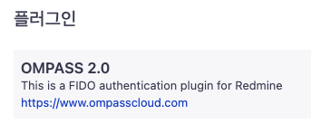
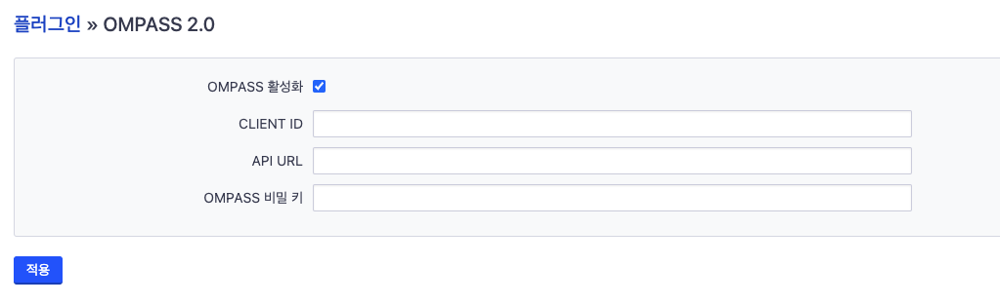
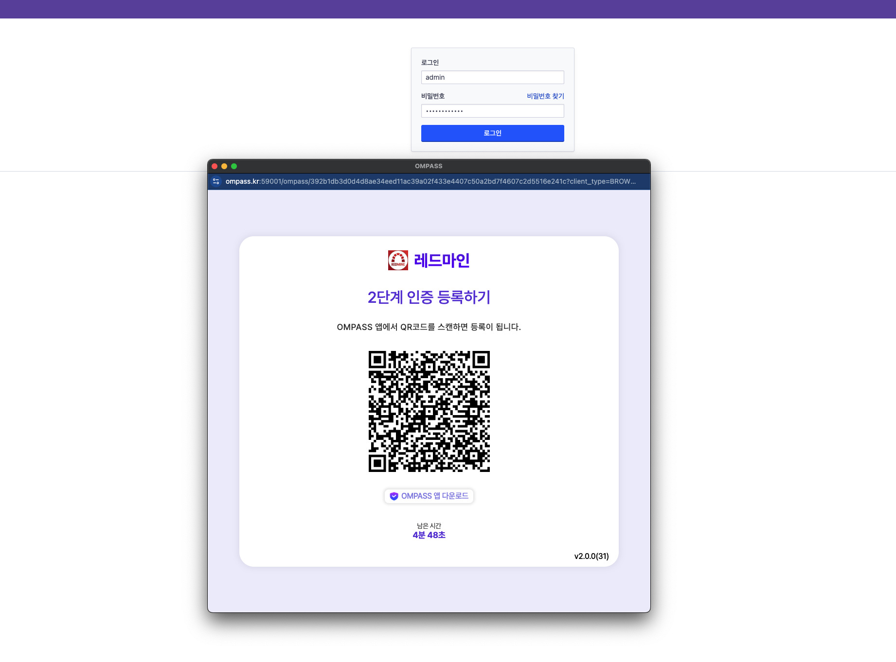

# OMPASS 레드마인 어플리케이션

## 개요
OMPASS 레드마인 어플리케이션은 레드마인 어플리케이션에서 강력한 2단계 인증을 추가하고 2단계 인증을 수행합니다.

>   <h4>연결 요구 사항</h4>
   >이 어플리케이션은 SSL TCP 포트 443에서 Ompass 서비스와 통신합니다.  
   >목적지 IP 주소 또는 IP 주소 범위를 사용하는 규칙으로 Ompass 서비스에 대한 아웃바운드 엑세스를 제한하는 방화벽 구성은 권장되지 않습니다.  
   >TLS 1.0 또는 1.1 연결이나 안전하지 않은 TLS/SSL 암호화 모음을 지원하지 않습니다.

### 사전 작업
1. **OMPASS Portal** 에 관리자 계정으로 로그인하세요.

2. **어플리케이션** → **추가**로 이동합니다.

3. **유형**을 **Redmine**으로 선택하고 이름, 정책 설정 등을 추가한 후 **저장**을 클릭합니다.

4. 어플리케이션 목록 중 생성한 **Redmine** 어플리케이션을 클릭합니다. **API 서버 주소**, **클라이언트 아이디**, **시크릿 키**를 가져옵니다.

## 레드마인 플러그인 설치
1. [레드마인 공식 플러그인](https://www.redmine.org/plugins) 홈페이지에서 OMPASS 플러그인을 다운로드합니다.
2. 레드마인의 plugins 디렉토리에 다운로드 받은 플러그인 zip 파일을 압축해제합니다.
3. 아파치를 재시작합니다.  

   `$ sudo systemctl restart apache2`
4. 관리자 권한이 있는 사용자로 레드마인에 로그인합니다.
5. 관리 > 플러그인탭을 선택 후 플러그인 목록에 OMPASS 2.0 이 조회되는지 확인합니다.  

   
6. OMPASS 플러그인 설정 클릭
7. 사전작업 4번에서 조회한 정보를 설정 필드에 입력 후 적용 버튼을 클릭합니다.  

   

8. 로그아웃 후 다시 로그인을 시도합니다.  

9. 기본 로그인 성공 후 OMPASS 2차인증 페이지 팝업이되면 OMPASS APP 으로 등록 후 로그인이 완료됩니다.  

   

  
   

