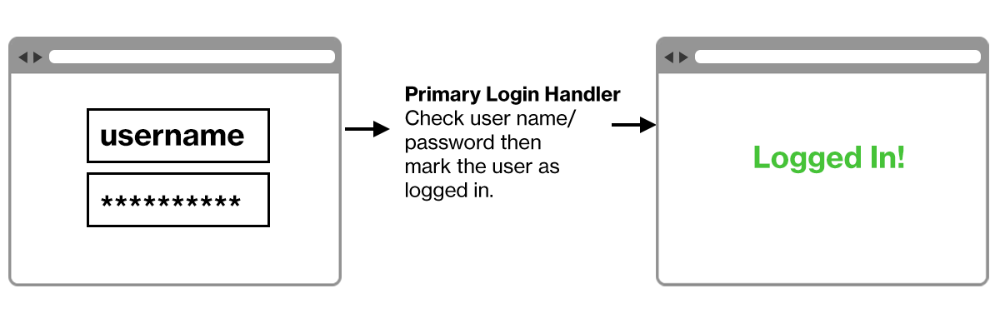
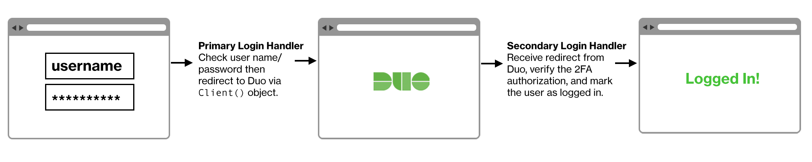

# OMPASS 웹 어플리케이션

## 개요
OMPASS 웹 어플리케이션은 웹 어플리케이션에서 강력한 2단계 인증을 추가하고 2단계 인증을 수행합니다.

OMPASS 2차 인증을 사이트에 구현하려면 로그인 핸들러를 두 부분으로 분활해야 합니다. 웹 어플리케이션의 프로그래밍 언어와 인증 프로세스에 익숙해야 합니다.

예를 들어, 일반적인 단일 요소 로그인 프로세스는 다음과 같습니다. 

  

귀하의 어플리케이션은 기본 인증을 처리하고 성공하면 사용자에게 액세스 권한을 제공합니다.

OMPASS 2차인증을 추가하면 다음과 같이 표시됩니다.  

  

귀하의 어플리케이션은 기본 인증을 계속 처리합니다. 기본 인증이 성공한 후 사용자는 보조 인증을 위해 OMPASS로 리다이렉션됩니다.  
OMPASS에서 리다이렉션에 대한 성공 응답을 수신하고 확인 후, 귀하의 어플리케이션은 사용자에게 엑세스를 제공합니다.

   >   <h4>연결 요구 사항</h4>
   >이 어플리케이션은 SSL TCP 포트 443에서 Ompass 서비스와 통신합니다.  
   >목적지 IP 주소 또는 IP 주소 범위를 사용하는 규칙으로 Ompass 서비스에 대한 아웃바운드 엑세스를 제한하는 방화벽 구성은 권장되지 않습니다.  
   >TLS 1.0 또는 1.1 연결이나 안전하지 않은 TLS/SSL 암호화 모음을 지원하지 않습니다.

## OMPASS 웹 SDK
언어별 SDK 는 준비중에 있습니다.

## OMPASS 웹 API
SDK로 사용할 수 없는 다른 언어를 사용하거나 SDK 중 하나를 사용하지 않고 OMPASS 인증을 구현하려면 [Auth API](https://ompasscloud.com/ko/document/rest-api-u2f/)를 참조하세요.

