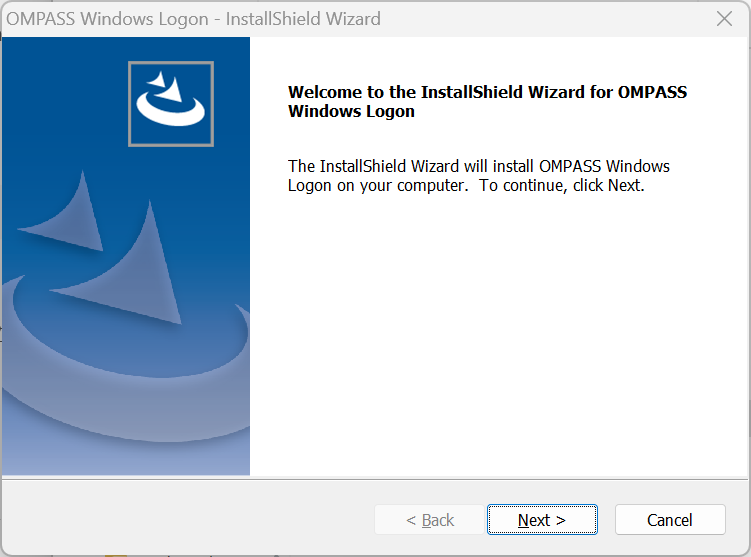
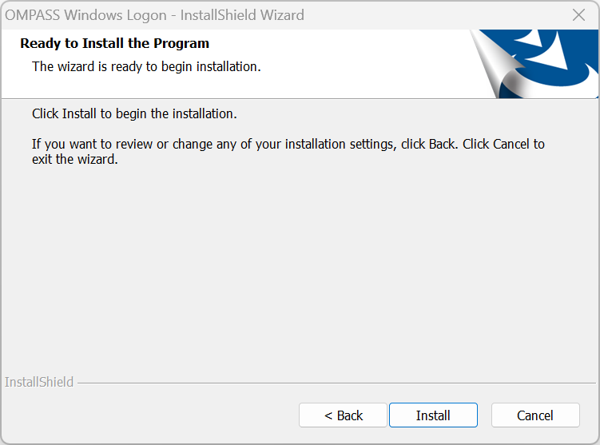
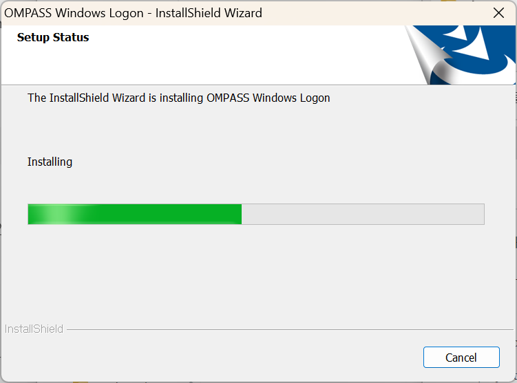
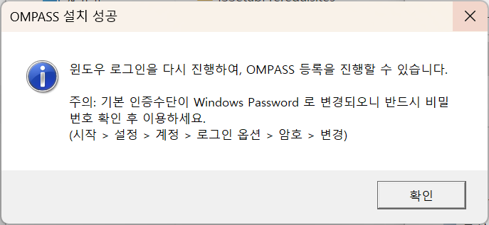
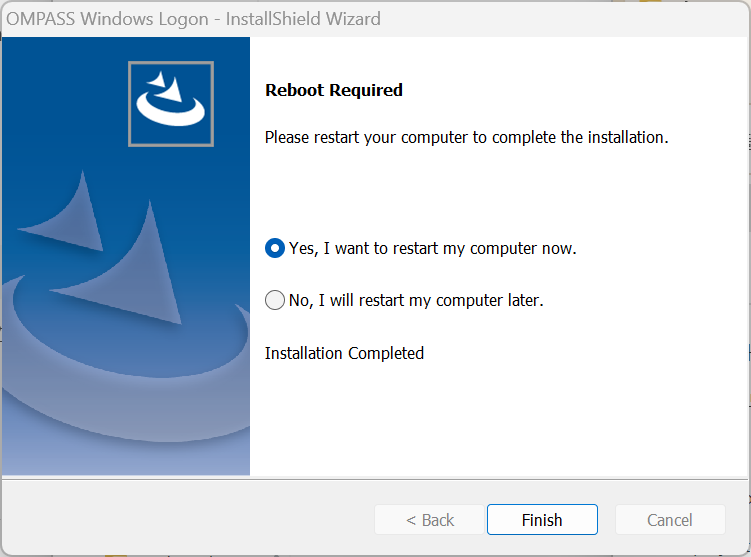
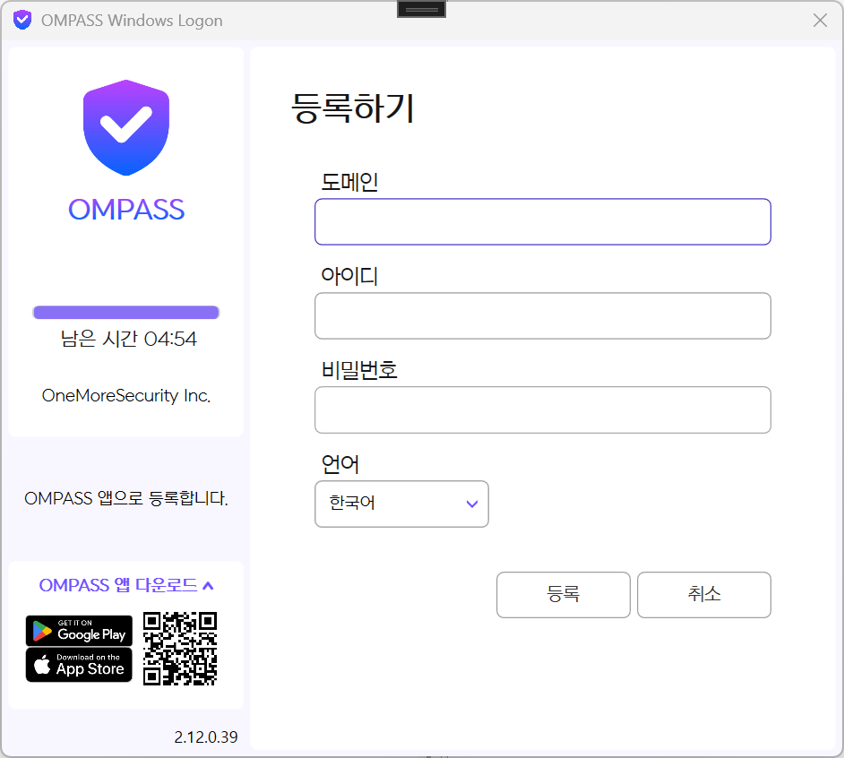
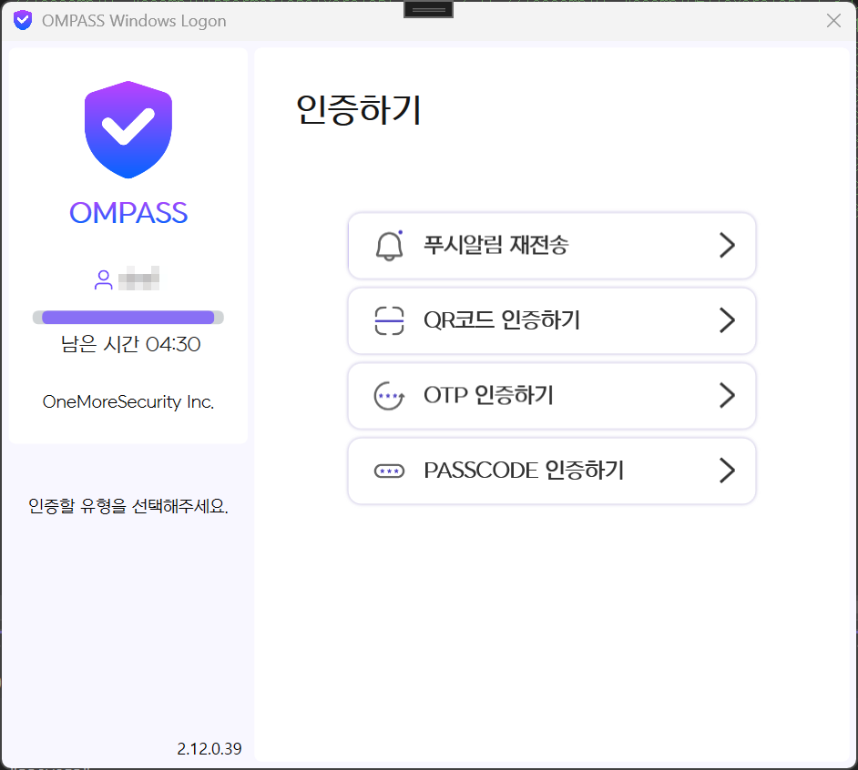

# OMPASS Windows Logon

## 개요
OMPASS Windows Logon 을 설치하여 Windows 운영 체제 로그온을 보호합니다.

## 중요 참고 사항
> OMPASS Windows Logon 을 사용하기 위해서는 클라이언트 프로그램 설치 전에 컴퓨터에 로그인하기 위해 비밀번호를 반드시 확인해야 합니다. 

## 사전 작업
1. **OMPASS Portal** 에 관리자 계정으로 로그인하세요.

2. **어플리케이션** → **추가**로 이동합니다.

3. **유형**을 **Windows 로그온**으로 선택하고 이름, 정책 설정 등을 추가한 후 **저장**을 클릭합니다.

4. 어플리케이션 목록 중 생성한 **Windows 로그온** 어플리케이션을 클릭합니다. **API 서버 주소**를 가져옵니다.

## OMPASS 설치
1. **OMPASS Portal** 에서 설치 패키지를 다운로드합니다. 

2. 압축 해제 후 **setup.exe**를 실행합니다. 

 

3. **Next** 를 클릭합니다.

 

4. **Install** 을 클릭합니다.

 

5. 설치가 완료되면 완료 메시지와 Windows 설정창이 팝업됩니다. 
> Windows 로그온 기본 인증수단이 Windows Password로 변경되오니 반드시 비밀번호를 확인하세요. 
> (시작 → 설정 → 계정 → 로그인 옵션 → 암호 → 변경)

6. Prerequisite으로 설치된 Microsoft Visual C++ 2015-2022 Redistributable 가 처음 설치되었다면 재부팅을 진행해주세요.
* *기존 사용자는 재부팅을 하지 않아도 됩니다.*

## 설정 테스트
Windows 로그온 스크린에서 비밀번호를 입력하면 OMPASS Windows Logon 인증을 진행합니다.

* OMPASS 앱이 설치되어있는 인증 장치(휴대전화)는 OMPASS Portal 에 등록 되어 있어야 합니다.

 

**도메인** 필드에 API 서버 주소를 입력하고 **아이디**와 **비밀번호**에 OMPASS Portal 계정 정보를 입력 후 인증을 진행합니다. 

등록이 성공적으로 완료되면 OMPASS Windows Logon을 통해 로그인됩니다.

다음 로그인부터는 아래와 같은 OMPASS 인증 화면이 표시됩니다.

## Windows 패스워드 없이 로그온
Windows에 패스워드 없이 로그온하려면 OMPASS Portal 에서 설정 가능합니다.

> 메뉴 → 어플리케이션 → Windows 로그온 → 설정 → 패스워드 없이 로그인

기본값은 OFF 이며 패스워드 없이 로그인하려면 ON으로 설정하세요.

